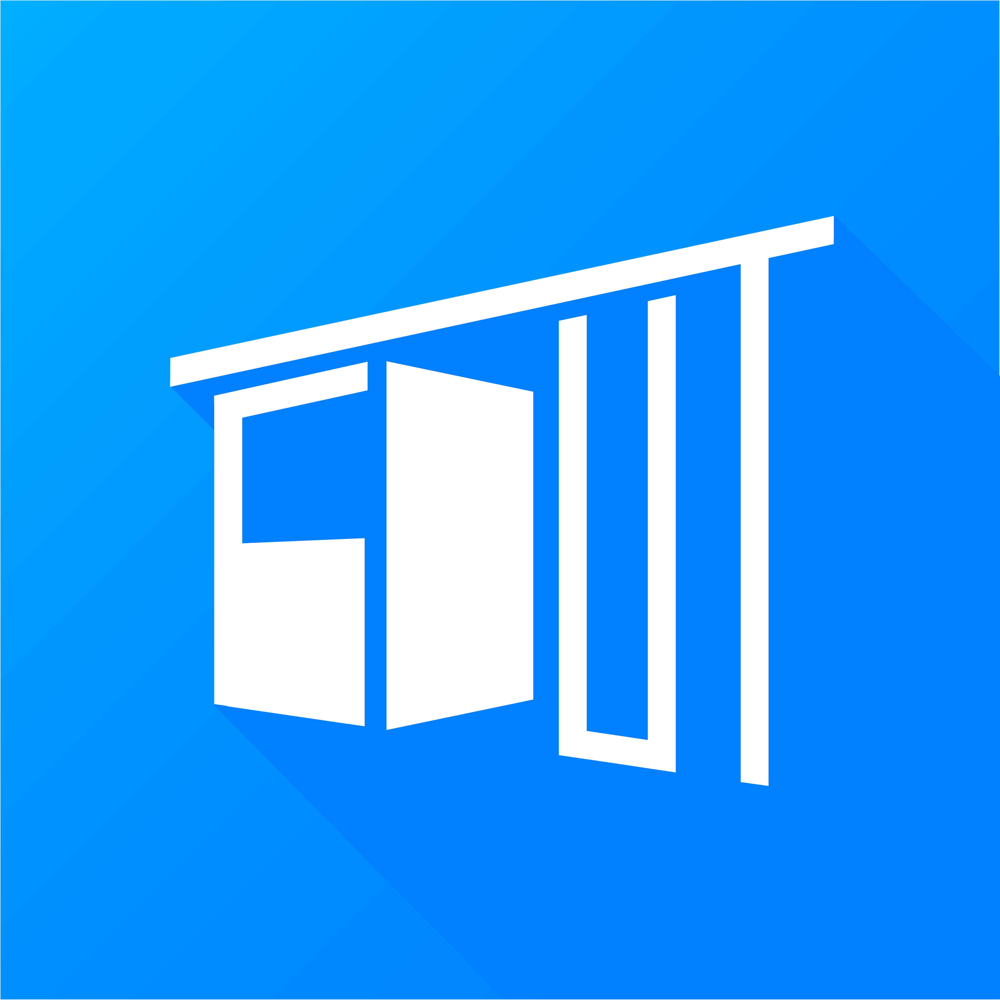
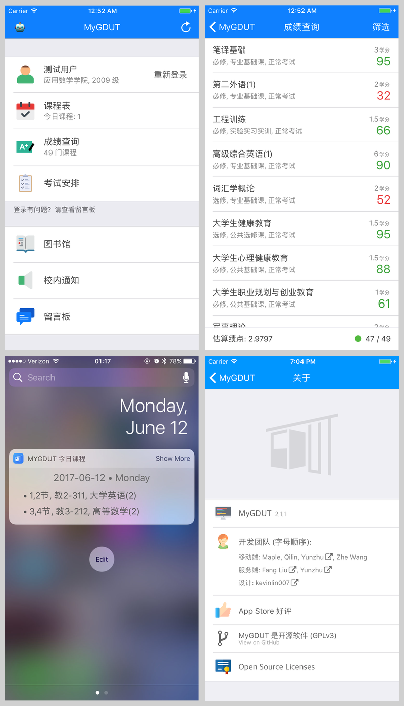

## sa-ios

A generic school app for college students.

This iOS client currently has ~5k monthly active users and roughly 10k installations.

## Supported Schools

The system currently supports 1 school.

- `GDUT` (Guangdong University of Technology):
  - Published on the App Store as [`MyGDUT`](https://itunes.apple.com/cn/app/id616723635)
  - Average rating: 4.5 stars
  - Monthly active users: ~5k

## Screenshots

### MyGDUT




## License
```
sa-ios
Copyright (C) 2017 Yunzhu Li

This program is free software: you can redistribute it and/or modify
it under the terms of the GNU General Public License as published by
the Free Software Foundation, either version 3 of the License, or
(at your option) any later version.

This program is distributed in the hope that it will be useful,
but WITHOUT ANY WARRANTY; without even the implied warranty of
MERCHANTABILITY or FITNESS FOR A PARTICULAR PURPOSE.  See the
GNU General Public License for more details.

You should have received a copy of the GNU General Public License
along with this program.  If not, see <http://www.gnu.org/licenses/>.
```
